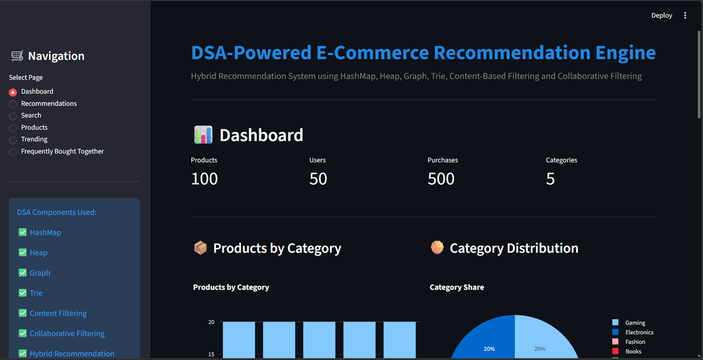
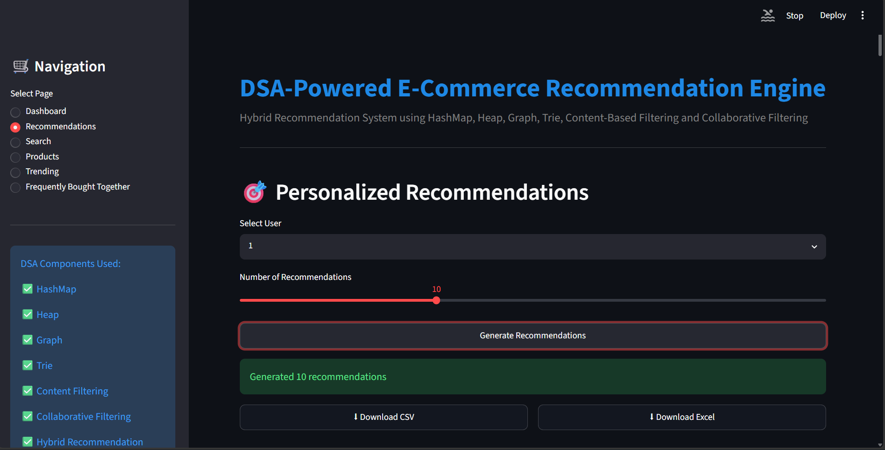
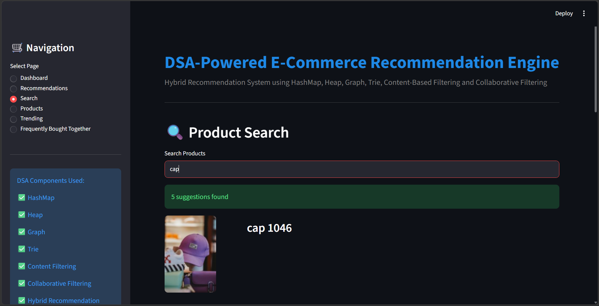
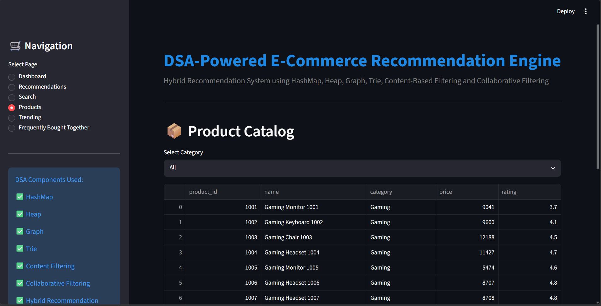
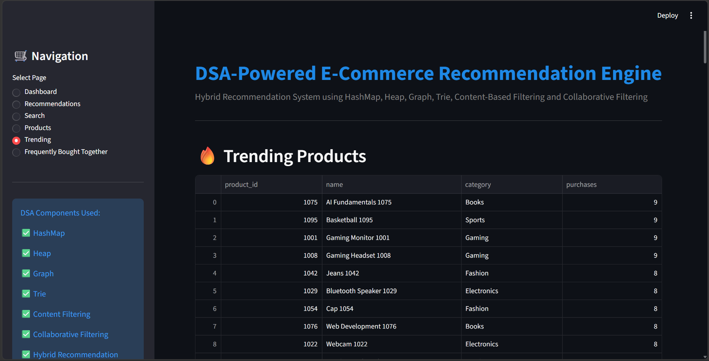
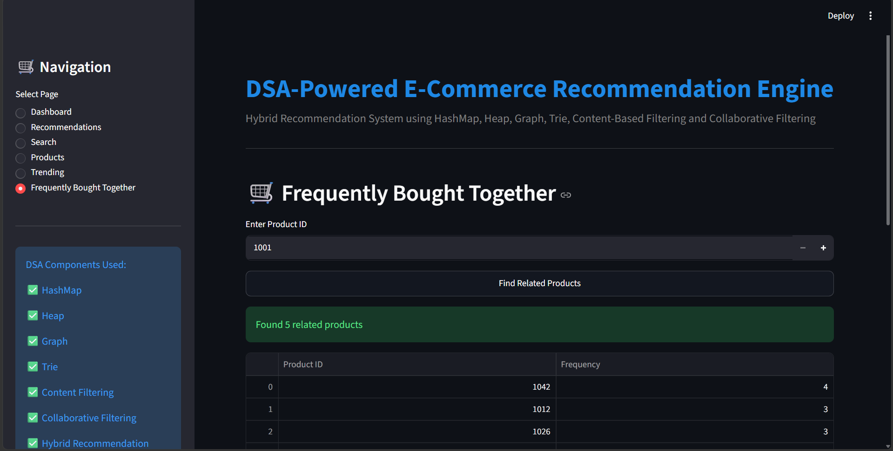
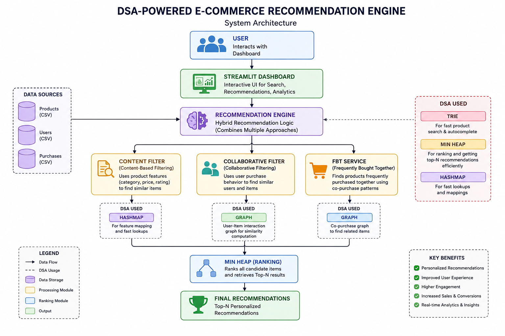

# 🛒 DSA-Powered Hybrid E-Commerce Recommendation Engine

A production-ready **Hybrid E-Commerce Recommendation System** built using **Data Structures & Algorithms (DSA)**, **Content-Based Filtering**, **Collaborative Filtering**, and an interactive **Streamlit Dashboard**.

This project simulates how modern e-commerce platforms generate personalized recommendations, trending products, frequently bought together suggestions, and intelligent product discovery.

---

## 🚀 Live Demo

Add your deployed Streamlit URL here:

```text
https://your-app-name.streamlit.app
```

---

## 📌 Project Overview

This project combines multiple recommendation strategies and DSA concepts to create a realistic recommendation platform.

The system analyzes:

* User purchase history
* Product relationships
* Product similarity
* User similarity
* Product popularity

to generate highly relevant recommendations.

---

## ✨ Key Features

### 🎯 Hybrid Recommendation Engine

Combines:

* Content-Based Filtering
* Collaborative Filtering
* Graph-Based Recommendations
* Popularity-Based Ranking

---

### 🔍 Smart Product Search

Implemented using:

* Trie Data Structure
* Prefix Matching
* Autocomplete Suggestions

---

### 🔥 Trending Products

Displays:

* Most purchased products
* Popular items
* Purchase frequency analytics

---

### 🛒 Frequently Bought Together

Implemented using:

* Graph Data Structure
* Product relationship modeling
* Co-purchase analysis

---

### 📊 Analytics Dashboard

Interactive visualizations powered by Plotly:

* Product Category Distribution
* Top Purchased Products
* Most Active Users
* Product Insights

---

### 📁 Export Functionality

Export recommendations as:

* CSV
* Excel (.xlsx)

---

## 🧠 Data Structures & Algorithms Used

| DSA Concept           | Purpose                                    |
| --------------------- | ------------------------------------------ |
| HashMap               | Fast product and user lookup               |
| Heap (Priority Queue) | Top-N recommendation ranking               |
| Graph                 | Frequently bought together recommendations |
| Trie                  | Product search autocomplete                |
| Sets                  | User similarity calculations               |
| Sorting               | Recommendation ranking                     |
| Dictionaries          | Score aggregation                          |

---

## 🤖 Recommendation Techniques

### 1. Content-Based Filtering

Recommends products based on:

* Category Similarity
* Price Similarity
* Rating Similarity

---

### 2. Collaborative Filtering

Finds users with similar purchase behavior and recommends products they have purchased.

Uses:

* Jaccard Similarity
* User Purchase Sets

---

### 3. Graph-Based Recommendations

Models relationships between products using an adjacency-list graph.

Supports:

* Frequently Bought Together
* Related Products

---

### 4. Popularity-Based Ranking

Handles:

* Cold Start Users
* New Users
* Trending Recommendations

---

### 5. Hybrid Recommendation System

Final recommendations are generated by combining:

```text
Content Filtering
+
Collaborative Filtering
+
Graph Recommendations
+
Popularity Scores
+
Heap Ranking
```

---

## 🏗️ System Architecture

```text
                    User
                      │
                      ▼
            Streamlit Dashboard
                      │
                      ▼
          Recommendation Engine
                      │
     ┌────────────────┼───────────────┐
     ▼                ▼               ▼
Content Filter   Collaborative   Graph Engine
                                  (FBT)
     │                │               │
     └────────────────┼───────────────┘
                      ▼
                Heap Ranking
                      ▼
              Final Results
```

---

## 📂 Project Structure

```text
E-Commerce-Product-Recommendation-Engine/
│
├── data/
│
├── images/
│   └── products/
│
├── src/
│   ├── dsa/
│   │   ├── hashmap_store.py
│   │   ├── heap_ranker.py
│   │   ├── graph_recommender.py
│   │   └── trie_search.py
│   │
│   ├── engine/
│   │   ├── content_filter.py
│   │   ├── collaborative_filter.py
│   │   ├── recommendation_engine.py
│   │   ├── intelligence_layer.py
│   │   └── fbt_service.py
│   │
│   ├── models/
│   │   ├── product.py
│   │   └── user.py
│   │
│   └── utils/
│       ├── data_loader.py
│       ├── export_utils.py
│       └── image_mapper.py
│
├── tests/
│
├── streamlit_app.py
├── generate_dataset.py
├── requirements.txt
├── LICENSE
└── README.md
```

---

## 📸 Screenshots

### Dashboard



---

### Recommendations



---

### Search System



---

### Product Catalog



---

### Trending Products



---

### Frequently Bought Together



---

### System Architecture



---

## ⚙️ Installation

### Clone Repository

```bash
git clone https://github.com/VaishnavaDevi-R/E-Commerce-Product-Recommendation-Engine.git

cd E-Commerce-Product-Recommendation-Engine
```

---

### Create Virtual Environment

```bash
python -m venv venv
```

---

### Activate Environment

#### Windows

```bash
venv\Scripts\activate
```

#### Linux / Mac

```bash
source venv/bin/activate
```

---

### Install Dependencies

```bash
pip install -r requirements.txt
```

---

### Run Application

```bash
streamlit run streamlit_app.py
```

---

## 📈 Future Enhancements

* Deep Learning Recommendations
* User Authentication
* Real-Time Recommendation Updates
* Product Image APIs
* Recommendation Evaluation Metrics
* Cloud Database Integration
* Docker Deployment
* Kubernetes Support

---

## 🎓 Learning Outcomes

Through this project, I gained practical experience in:

* Data Structures & Algorithms
* Recommendation Systems
* Object-Oriented Programming
* Graph-Based Modeling
* Streamlit Development
* Data Visualization
* Software Architecture
* Python Application Development

---

## 👩‍💻 Author

**Vaishnava Devi**

---

## 📜 License

This project is licensed under the MIT License.

See the LICENSE file for details.

---

⭐ If you found this project useful, consider giving it a star on GitHub!
